# Compliance Document Review App

A multi-tenant institutional web application that replaces ad-hoc financial compliance review with a shared, tenant-isolated queue, recorded audit events, and an AI assist panel that flags regulatory concerns (missing disclosures, misleading claims, fee schedule discrepancies, missing signatures) without ever automating the decision. The human compliance officer always makes the final call.

Built across five tracks: Backend, Frontend, AI, Data Engineering, DevOps/Platform.

See also: [`docs/technical-implementation-plan.md`](./docs/technical-implementation-plan.md) for detailed per-track scope, and [`docs/architecture.md`](./docs/architecture.md) for system and data/AI diagrams.

---

## Engineering Team & Core Track Ownership

| Team Member | Track | Specialization & Key Responsibilities |
|---|---|---|
| **Basamsetti Venkata Vamsi** | **AI Engineering** | Ordered custom-regex PII masking, prompt engineering, structured JSON schema enforcement, and third-party LLM integrations (Gemini / Groq). |
| **Kashish Agarwal** | **Backend Engineering** | FastAPI REST endpoints, multi-tenant workspace architecture, session/role auth enforcement (server-side 403 gates), document lifecycle state machine, and Celery/Redis background task orchestration. |
| **Daniel Ojo** | **Frontend Engineering** | Next.js 16 App Router + TypeScript SPA, split-pane review interface, Server-Sent Events (SSE) live sync, two-stage document upload modal with toast validation, and dedicated institutional Admin Console. |
| **Jemarco Briz** | **Data Engineering** | Format-aware text extraction (PDF/DOCX/XLSX), local vector embeddings (`BAAI/bge-base-en-v1.5`), `pgvector` HNSW index architecture, and the 3-phase retrieval engine. |
| **Cross-Track / Shared** | **DevOps & Platform** | Docker Compose orchestration, automated Alembic migrations & seeding, environment controls, and GitHub Actions CI pipelines. |

---

## Core Capabilities & Security Invariants

- **Multi-Tenant Isolation**: Every document, review, audit log, and user is strictly partitioned by `workspace_id`. Cross-tenant data access is blocked by server-side 403 authorization gates.
- **Invite-First Zero-Trust Onboarding**: Open self-registration into roles is disabled. Workspace Administrators issue single-use cryptographic invitation tokens (7-day TTL) to onboard Financial Advisors and Compliance Officers.
- **Single Administrator Architecture**: Guaranteed by PostgreSQL database-level constraints (`uq_workspace_single_admin` partial unique index and `chk_admin_must_be_officer` check constraint).
- **Two-Stage Document Upload with Toast Validation**: Advisors receive upfront guidance on accepted formats (PDF, DOCX, XLSX) and 10 MB limits, immediate non-blocking toast validation on file selection, and a verified pre-submission confirmation screen.
- **Review Concurrency Locking**: Compliance officers acquire atomic claims (`POST /documents/{id}/claim`) on queue items, preventing race conditions or duplicate reviews across officers.
- **PII-Masked AI Assist**: All document text is masked by the worker's ordered custom-regex masker **before** sending to any external LLM provider (Google Gemini or Groq). Reverse mappings remain server-side.
- **Audit Trail**: Status transitions, claims, officer decisions, and revision resubmissions are recorded with user identity and timestamp.

---

## System Architecture & Current App Flow

The application enforces a **Zero-Trust Multi-Tenant Architecture** where open self-registration into roles is disabled, preventing cross-tenant document exposure. Every document, review, audit log entry, and user account is strictly scoped by `workspace_id`.

```mermaid
flowchart TD
    subgraph Onboarding["1. Tenant Provisioning & Zero-Trust Onboarding"]
        Register["Org Creator Registers<br/>(Sets Company Name & Admin Credentials)"] --> Workspace["Workspace Initialized<br/>(Single Admin Invariant Enforced)"]
        Workspace --> AdminConsole["Admin Console (/admin)<br/>(Issues Single-Use Role Invitations)"]
        AdminConsole --> Invite["Invite Token (7-Day TTL)<br/>/accept-invite?token=..."]
        Invite --> MemberJoin["Member Sets Password & Joins<br/>(Assigned Role: Advisor or Officer)"]
    end

    subgraph AdvisorFlow["2. Advisor Workflow"]
        MemberJoin -.->|Advisor| AdvSpace["Advisor Workspace (/advisor)"]
        AdvSpace --> UploadModal["Two-Stage Upload Modal<br/>(Guidance: PDF/DOCX/XLSX, 10 MB Limit)"]
        UploadModal --> ToastValidation["Client-Side Toast Validation<br/>(Immediate Feedback, Zero Bad Submissions)"]
        ToastValidation --> Staging["Confirmation Screen<br/>(Size, Format Tag, Verified Status)"]
        Staging --> DocSubmit["Submit Document<br/>POST /documents"]
    end

    subgraph Processing["3. Async Ingestion & Masking Pipeline"]
        DocSubmit --> RedisQueue["Redis Task Queue"]
        RedisQueue --> CeleryWorker["Celery Worker"]
        CeleryWorker --> Extract["Text Extraction<br/>(pdfplumber / XML ZIP / openpyxl)"]
        Extract --> Mask["PII Masker (Ordered Regex)<br/>Masks Client Info Before Any LLM Call"]
        Mask --> Embed["Vector Embeddings (Local bge-base)"]
        Embed --> PGVector["pgvector Similarity Search<br/>(Retrieves Applicable Policy Rules)"]
        PGVector --> LLM["LLM Analysis (Gemini / Groq)<br/>(Generates Regulatory Flags)"]
    end

    subgraph OfficerFlow["4. Compliance Officer Workflow"]
        MemberJoin -.->|Officer| OffSpace["Compliance Workspace (/compliance-officer)"]
        OffSpace --> SSEStream["Live SSE Sync<br/>(/notifications/stream)"]
        SSEStream --> Queue["Filterable Review Queue<br/>(Unreviewed / Claimed / Reviewed)"]
        Queue --> ClaimDoc["Claim Document Lock<br/>POST /documents/{id}/claim"]
        ClaimDoc --> SplitPane["Split-Pane Review Interface<br/>(Original Document Preview + AI Flags Panel)"]
        SplitPane --> Decision["Officer Final Decision<br/>Approve · Reject · Needs Revision"]
        Decision --> AuditLog["Audit Events<br/>(Timestamp, Officer ID, Comment)"]
        Decision -.->|If Needs Revision| AdvSpace
    end
```



---

## Key Application Flows

### 1. Organization & Workspace Provisioning
- **Self-Contained Tenancy**: When an organization registers (`POST /api/auth/workspace`), a unique workspace is provisioned with an isolated domain slug.
- **Single Administrator Architecture**: The organization creator is initialized as the workspace's sole **Workspace Administrator** (`is_admin = True`, `role = officer`).
- **Database Engine Invariants**:
  - `uq_workspace_single_admin`: PostgreSQL partial unique index guaranteeing at the database engine level that no workspace can ever contain more than one administrator.
  - `chk_admin_must_be_officer`: PostgreSQL check constraint guaranteeing that Financial Advisors (`role = advisor`) can physically never hold administrator privileges.

### 2. Zero-Trust Team Onboarding (Invite-First)
- **Open Registration Disabled**: To prevent unauthorized users from registering and reading confidential customer documents across companies, open self-registration into roles is disabled.
- **Invite Generation**: Administrators navigate to `/admin` to issue role-scoped invitations (`POST /admin/invitations`) for either **Financial Advisors** or **Compliance Officers**.
- **Single-Use Secure Tokens**: Invitations generate cryptographic single-use tokens with a 7-day TTL.
- **Acceptance Flow**: Prospective team members visit `http://localhost:3000/accept-invite?token=...`, set their account password, and join their organization with standard member access (`is_admin = False`).
- **Administrative Lifecycle**: Administrators track pending invitations, view generated invite links, and revoke outstanding invitations directly from the Admin Console.

### 3. Financial Advisor Document Submission
- **Two-Stage Upload Modal**:
  - **Upfront Format Guidance**: Prior to file selection, advisors see explicit guidance for supported formats: **PDF (`.pdf`)**, **Word (`.docx`)**, and **Excel (`.xlsx`)**, along with a **10 MB maximum file size cap** and a tenant-encryption badge.
  - **Immediate Client-Side Toast Validation**: If an unsupported extension or a file exceeding 10 MB is selected or dropped, the app immediately fires a non-intrusive `toast.error` notification and resets the file input—preventing invalid files from staging.
  - **Confirmation Screen**: Staged files display a confirmation card showing the file icon, file name, formatted size (e.g. `2.45 MB`), format badge, and a verified readiness checkmark before submission.
- **Audit & Revision Resubmissions**: If an officer marks a document as **Needs Revision**, the advisor can resubmit an updated file. The new version is linked to the previous document, maintaining a continuous audit thread.

### 4. Compliance Officer Review & Concurrency Control
- **Shared, Real-Time Review Queue**: Officers monitor an active review queue updated in real time via Server-Sent Events (SSE).
- **Concurrency Locking (Claims)**: Before beginning a review, an officer claims the document (`POST /documents/{id}/claim`). This places an atomic claim lock on the record, preventing multiple compliance officers from reviewing or deciding the same submission concurrently.
- **Split-Pane Review Interface**:
  - **Left Pane**: Document viewer with metadata (advisor name, submission timestamp, document version).
  - **Right Pane**: AI Assist Panel detailing automated regulatory checks, flagged issues, and policy rule citations.
  - **Degraded AI Handling**: Extraction, storage, embedding, retrieval, and LLM failures are persisted with structured error codes and safe user messages. Officers can still complete manual reviews.
- **Human-in-the-Loop Decisions**: The officer records a binding decision (**Approve**, **Reject**, or **Needs Revision**) with mandatory audit reasoning.

### 5. Dedicated Institutional Admin Console (`/admin`)
- **Role-Gated Access**: Restricted strictly to authenticated Workspace Administrators (`is_admin = True`). Standard members attempting access are redirected.
- **Dynamic Team Directory**: Displays real-time workspace statistics (Total Members, Compliance Officers, Financial Advisors, Pending Invitations).
- **Access Level Enforcement**: Members are clearly demarcated as **Workspace Administrator** (with access badge and key icon) or **Member**.
- **Secure Member Removal**: Administrators can remove members from the workspace; confirmation is handled cleanly with non-blocking toast notifications.

---

## Tech Stack

| Layer | Stack |
|---|---|
| Frontend | Next.js 16 App Router + TypeScript, Tailwind CSS v4, Lucide React, Vitest, Server-Sent Events (SSE) |
| Backend | Python 3.12, FastAPI, SQLAlchemy 2.0 (async), Alembic, Celery + Redis |
| Database | PostgreSQL 16 + `pgvector` (HNSW index) |
| Storage | MinIO (S3-compatible bucket storage for raw documents) |
| AI | Gemini API (Google AI Studio free tier) or Groq — no production Anthropic credits |
| PII Masking | Ordered custom regex masker with server-side reverse mappings |
| Embeddings | Local `sentence-transformers` (`BAAI/bge-base-en-v1.5`, 768 dimensions) — never sent to a third party |
| Infra | Docker Compose v2, GitHub Actions CI |

### Frontend & Real-Time Architecture Highlights

- **Next.js 16 App Router**: Component-driven architecture built with strict TypeScript enforcement (`tsc --noEmit`).
- **Server-Sent Events (SSE) Live Sync**: Native real-time streaming via `useLiveSync` connecting to `/notifications/stream`, refreshing notifications and queue/review state events with automatic reconnects.
- **Resilient AI Degradation**: Explicit UI handling for pending and failed analyses. API responses expose `error_code`, `user_facing_error`, and `manual_review_required`, allowing officers to proceed with manual reviews uninterrupted.
- **Institutional Toast System**: Non-blocking, accessible visual feedback mounted globally at root layout (`frontend/components/Toast.tsx`), replacing default browser alerts with professional status messaging.
- **Internal Routing Protection**: Endpoints and slugs (e.g. `/{role}/{slug}`) are encapsulated within user navigation components, preventing exposure of internal routing paths.
- **Testing & Verification**: Vitest and `@testing-library/react` test suites verifying component resilience and degraded state handling (`frontend/__tests__/degraded-state.test.tsx`), accompanied by ESLint flat config.

Full rationale for each choice is in [`docs/technical-implementation-plan.md §4`](./docs/technical-implementation-plan.md#4-tech-stack-by-track).

## Continuous Integration and Branch Protection

The repository CI workflow runs for pull requests targeting `main` and for pushes to
`main`. It validates Python linting, Alembic migrations against temporary PostgreSQL
and pgvector, backend and worker tests, frontend linting/type checking/tests/build,
and all application Docker images through Compose.

See [`docs/ci-cd.md`](./docs/ci-cd.md) for the feature-branch workflow, the exact
local validation commands, required branch protection settings, and the checks that
must pass before merging. There is no deployment workflow until a production hosting
target and its protected credentials are established.

---

## Getting Started

This project is designed to run with Docker Compose so every teammate uses the same
PostgreSQL, Redis, backend, worker, and frontend versions.

### Prerequisites

Install the following on your laptop:

- Git
- Docker Engine or Docker Desktop with Compose v2
- At least 4 GB of available memory for the containers
- An LLM API key for AI features. Google AI Studio/Gemini is the recommended provider.

Check the installations:

```bash
git --version
docker --version
docker compose version
```

### 1. Clone the repository

Replace `<repository-url>` with the repository URL provided by the team:

```bash
git clone <repository-url>
cd Compliance-Document-Review-App
```

### 2. Create the local environment file

Create a local `.env` file; never commit it or put real API keys in source files.
The Compose file provides development defaults for database, Redis, and MinIO.

Set at least these values in `.env`:

```dotenv
LLM_API_KEY=your-provider-api-key
LLM_PROVIDER=gemini
SESSION_SECRET=replace-with-a-long-random-value
OFFICER_SIGNUP_CODE=replace-with-a-strong-one-time-code
```

Supported provider values are `gemini` and `groq`. Leave `LLM_API_KEY` empty when
working only on the non-AI scaffold; the API can still start, but AI analysis will
not be available.
Use a private value for `OFFICER_SIGNUP_CODE`; it is required when creating a
compliance officer account and should be changed from the local development value
before sharing or deploying the environment.

The Compose file supplies the container-internal database and Redis URLs. Do not
replace `DATABASE_URL` with `localhost` for the Docker workflow: inside the backend
container, the database hostname is `postgres` and the Redis hostname is `redis`.

### 3. Start the complete environment

Build the images and start all services:

```bash
docker compose up --build
```

The first run downloads the base images and Python/Node dependencies and may take a
few minutes. Keep this terminal open to see application logs. To start in the
background instead:

```bash
docker compose up --build -d
docker compose logs -f backend
```

The backend waits for healthy Postgres, Redis, and MinIO services. Its entrypoint runs
`alembic upgrade head` before starting Uvicorn. The worker waits for the backend
healthcheck, then seeds rules and precedents before starting Celery; it does not run
migrations.

### 4. Application Endpoints & Ports

Once the containers are running, the application exposes the following endpoints:

| Service | URL | Purpose | Access & Credentials |
|---|---|---|---|
| **Frontend Application** | <http://localhost:3000> | Next.js Web Interface | Public entry / login |
| **Workspace Admin Console** | <http://localhost:3000/admin> | Team directory & invite-first onboarding | Requires Workspace Administrator session |
| **Financial Advisor Workspace** | <http://localhost:3000/advisor> | Document upload, tracking & revisions | Requires Financial Advisor session |
| **Compliance Officer Workspace** | <http://localhost:3000/compliance-officer> | Review queue, AI assist & decisions | Requires Compliance Officer session |
| **Backend REST API** | <http://localhost:8000> | FastAPI API server | Gated with session Bearer auth |
| **Interactive API Documentation** | <http://localhost:8000/docs> | Swagger UI for exploring all endpoints | Open in browser |
| **API Health Check** | <http://localhost:8000/health> | Backend readiness endpoint | Returns `{"status":"ok"}` |
| **MinIO Object Storage Console** | <http://localhost:9001> | Raw file bucket management | `minioadmin` / `minioadmin` |
| **PostgreSQL Database** | `localhost:5433` | PostgreSQL 16 + `pgvector` | `compliance` / `compliance` |

Verify the backend from a terminal:

```bash
curl http://localhost:8000/health
```

Expected response:
```json
{"status":"ok"}
```

---

### 5. Running Verification & Automated Tests

#### Backend Automated Test Suite
Run the backend test suite (covering multi-tenant admin security, role boundaries,
claim concurrency, invite-first flows, and notifications) inside the Docker container:

```bash
docker compose exec -T backend sh -lc 'PYTHONPATH=/app pytest -q tests'
```

#### Frontend TypeScript Verification & Tests
Verify strict TypeScript compilation with zero errors across all components:

```bash
docker compose exec -T frontend npx tsc --noEmit
```

Run frontend unit and component tests:

```bash
docker compose exec -T frontend npm test -- --run

#### Worker extraction and AI tests

```bash
docker compose exec -T worker pytest -q worker/data_eng worker/ai
```

These tests cover format-specific extraction, scanned/corrupted/empty files,
fail-closed PDF handling, privacy masking, retrieval failures, structured error
persistence, and LLM fallback behavior.
```

---

### Database Migrations & Invariants

Database schemas and constraints are managed through Alembic. When the backend container boots, it automatically applies all pending migrations.

Key architectural migrations:
- `c7a8b9d0e1f2_add_workspaces_and_invitations.py`: Establishes the multi-tenant schema with `workspaces` and `invitations` tables, linking documents, users, and audit logs by `workspace_id`.
- `f1a2b3c4d5e6_enforce_single_workspace_admin.py`: Enforces single administrator integrity via `uq_workspace_single_admin` partial unique index and role invariants (`chk_admin_must_be_officer`).
- `9e7f6a1b2c3d_add_structured_analysis_errors.py`: Adds persisted `error_code`, `user_facing_error`, and `technical_error` fields to `AIAnalysis`.

To manually run migrations inside the backend container:

```bash
docker compose exec -T backend alembic upgrade head
```

---

### Stop, Inspect, and Reset the Environment

```bash
# Stop containers and preserve database data
docker compose down

# View running container status
docker compose ps

# Follow logs for specific services
docker compose logs -f backend
docker compose logs -f frontend

# Clean reset: stop containers and delete database/storage volumes
docker compose down -v
docker compose up --build
```

> [!WARNING]
> Running `docker compose down -v` permanently deletes local PostgreSQL data, Redis queue state, and MinIO document storage. Use it when you intentionally want a clean slate.

---

### Troubleshooting

**Port 5432 is already in use**
Compose defaults to host port `5433`, preventing conflicts with a local PostgreSQL installation. To override:
```bash
POSTGRES_PORT=5434 docker compose up --build
```

**Port 8000 or 3000 is already in use**
Stop the process occupying the port, or edit the host-side port mapping in `docker-compose.yml`. The container port (right side of `:`) must remain unchanged.

**A container will not start after configuration changes**
Rebuild the affected services:
```bash
docker compose up --build backend worker frontend
```

---

### Implementation Status

The application provides an enterprise-ready, tenant-isolated compliance review platform:
- **Backend & Worker**: FastAPI REST API, Celery + Redis async worker pipeline, custom-regex PII masking, local vector embeddings (`bge-base-en-v1.5`), `pgvector` retrieval engine, structured failure handling, Server-Sent Events (SSE) notification streaming, and backend-owned Alembic migrations.
- **Frontend**: Next.js 16 App Router interface, Tailwind CSS v4, split-pane advisor/compliance officer workflows, real-time live synchronization via SSE, institutional toast alerts, two-stage advisor upload modal with client-side toast validation, and dedicated institutional Admin Console.
