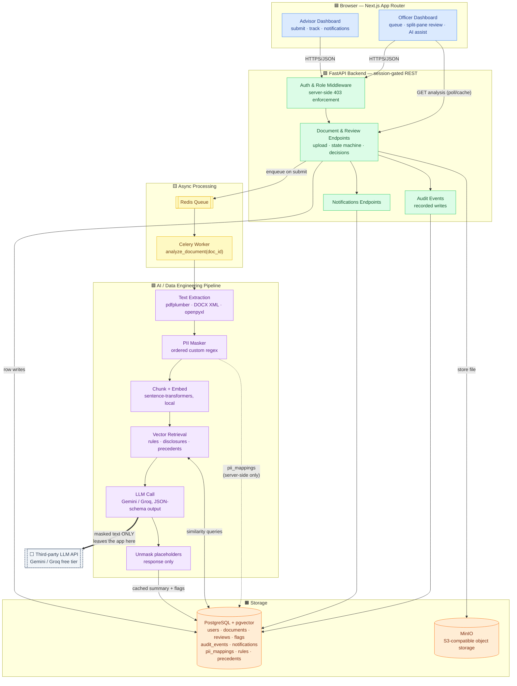
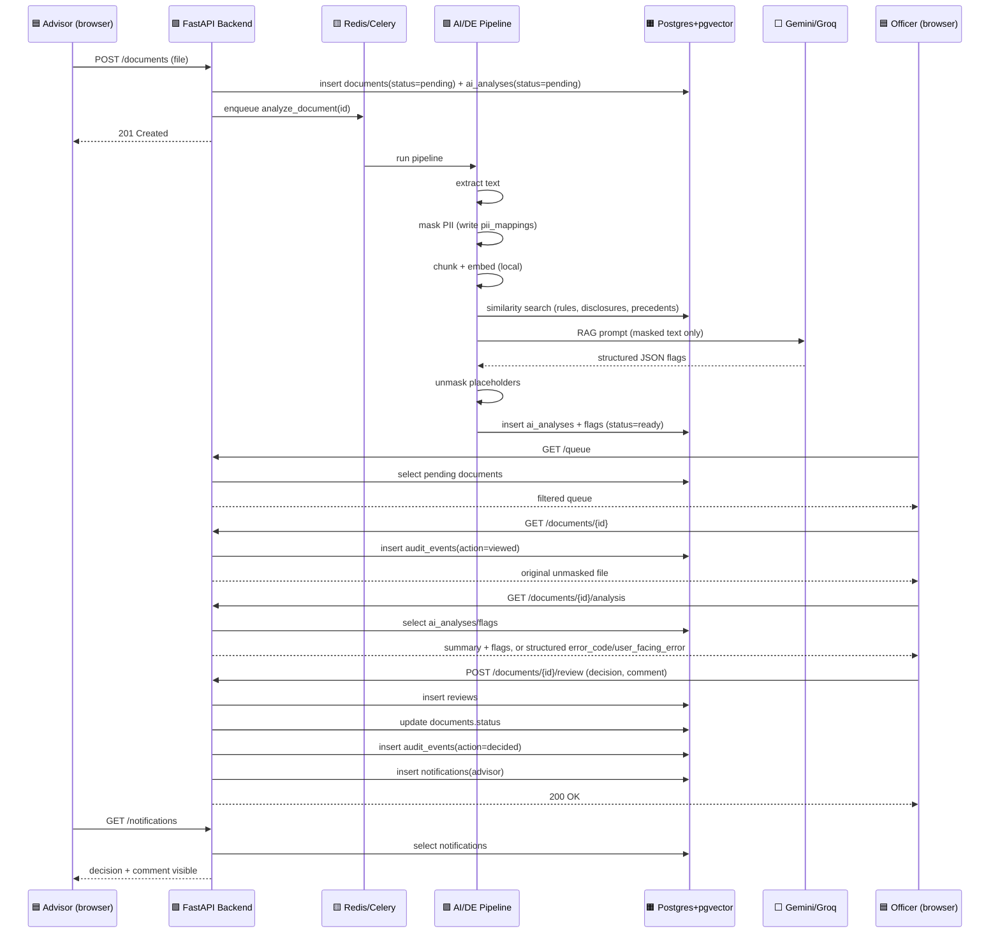
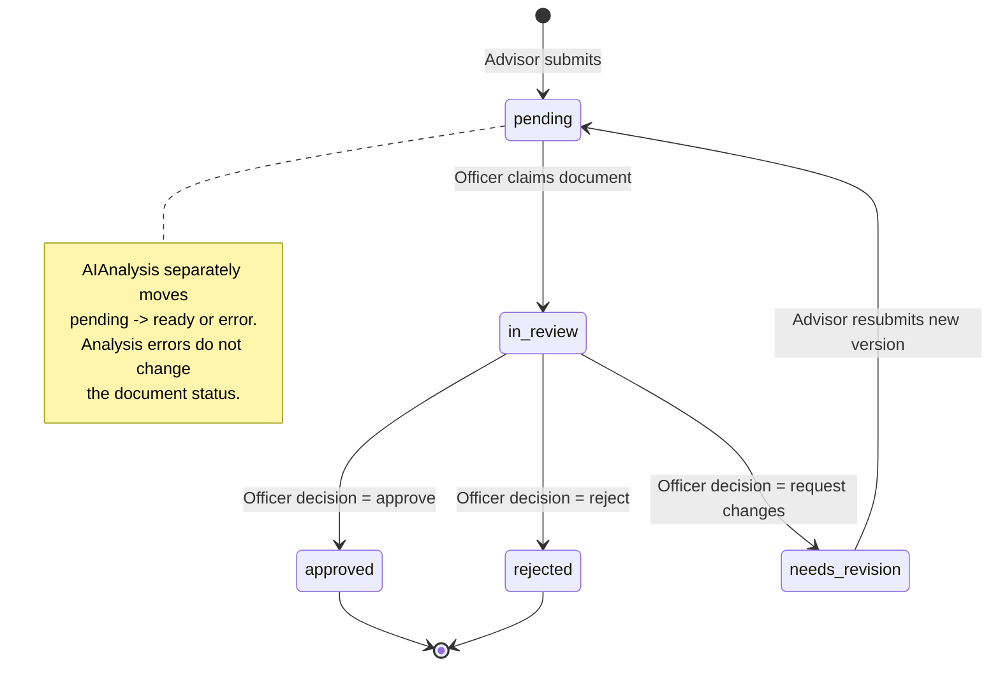

# Architecture — Compliance Document Review App

This document covers three layers of the system:

1. **[Whole-Application Architecture](#1-whole-application-architecture)** — how the frontend, backend, worker, database, and vector store fit together.
2. **[Data / AI Architecture](#2-data--ai-architecture-ingestion--retrieval--generation)** — the ingestion → masking → embedding → retrieval → generation pipeline, the most structurally interesting part of the system.
3. **[Cross-Track Sequence](#3-sequence-submission--decision-cross-track-view)** and **[Document Lifecycle](#4-document-lifecycle-state-machine)** — how a single document moves through the system end to end.

Diagrams are in [Mermaid](https://mermaid.js.org/); they render natively on GitHub and in most Markdown viewers/IDEs (VS Code, Obsidian, etc.).

### Legend

| Color | Layer |
|---|---|
| 🟦 Blue | Client / UI |
| 🟩 Green | Backend API |
| 🟨 Yellow | Async processing (queue/worker) |
| 🟪 Purple | AI / Data pipeline |
| 🟧 Orange | Storage |
| ⬜ Grey | Third-party / external |

---

## 1. Whole-Application Architecture

### Explanation

- **Client tier** is a Next.js App Router application with role-gated routes; both dashboards call the same FastAPI backend, never the AI pipeline directly.
- **Edge API** is the only thing the browser talks to. Auth middleware runs on *every* request and independently re-verifies role — this is what makes the role boundary hold at the API rather than only in the UI.
- **Async layer** exists because AI analysis cannot sit in the request/response cycle of the upload endpoint: LLM latency plus rate limits would make `POST /documents` unacceptably slow or flaky. Celery + Redis decouples "save the file and confirm to the advisor" from "run the AI pipeline." Provider calls use bounded retry/backoff where configured; analysis failures are persisted rather than silently retried by the task.
- **The single most important edge in this diagram** is the thick edge from `LLM` to the external provider, labeled *"masked text ONLY leaves the app here."* Everything upstream (extraction, masking) happens inside the app's own process — nothing crosses the network boundary until after masking. This is architectural enforcement of the privacy wall, not just a coding convention.
- **Storage** is split: Postgres holds all structured/relational/vector data (single system, per the pgvector requirement); raw files live on a separate volume/bucket referenced by `file_reference`, keeping large binary blobs out of the relational database.
- **Fail-closed degradation** is explicit: storage, extraction, embedding, retrieval, and LLM failures set `ai_analyses.status = error`, persist an `error_code`, safe `user_facing_error`, and internal technical detail. The officer-facing analysis endpoint returns that structured error payload, while manual review remains available.

---

## 2. Data / AI Architecture (Ingestion → Retrieval → Generation)

```mermaid
flowchart LR
    subgraph Ingest["🟪 1. Ingestion — Data Engineering"]
        Raw["Raw file<br/>PDF / DOCX / XLSX"]
        Ext["Format-specific extractor"]
        Raw --> Ext
    end

    subgraph Privacy["🟪 2. Privacy Boundary — AI"]
        NER["Ordered regex masking<br/>names · emails · phones · SSNs<br/>account numbers · currency"]
        Map[("pii_mappings table<br/>placeholder ↔ real value")]
        Masked["Masked text<br/>[CLIENT_1] used $[AMOUNT_1] ..."]
        Ext --> NER --> Masked
        NER -. "writes mapping" .-> Map
    end

    subgraph Chunk["🟪 3. Chunking + Embedding — Data Engineering"]
        Split["Sentence-aware splitter<br/>800-char chunks,<br/>150-char overlap"]
        Enc["Local encoder<br/>BAAI/bge-base-en-v1.5<br/>768-dim, sentence-transformers"]
        Masked --> Split --> Enc
    end

    subgraph VStore["🟧 pgvector — HNSW, cosine"]
        Rules[("rules<br/>compliance rules,<br/>prohibited claims")]
        Discl[("rules — disclosure type<br/>approved disclosure texts")]
        Prec[("precedents<br/>masked past docs +<br/>decision + comment")]
    end

    subgraph Retrieval["🟪 4. Retrieval — 3 jobs, Data Engineering"]
        R1["Rule retrieval<br/>per document section"]
        R2["Disclosure-by-absence<br/>nearest disclosure > threshold<br/>= missing"]
        R3["Precedent search<br/>top 3 similar past documents"]
    end

    subgraph Gen["🟪 5. Generation — AI"]
        Prompt["RAG prompt =<br/>masked section + retrieved rules"]
        LLMCall["Gemini / Groq<br/>JSON-schema forced output"]
        Validate["Pydantic validation<br/>passage · rule_id · explanation · severity"]
        UnmaskR["Re-inject real values<br/>from pii_mappings<br/>response serialization only"]
    end

    Output[["ai_analyses + flags<br/>cached, one row per document"]]

    Enc --> R1
    Enc --> R2
    Enc --> R3
    Rules <--> R1
    Discl <--> R2
    Prec <--> R3

    R1 --> Prompt
    R2 --> Prompt
    R3 --> Prompt
    Prompt --> LLMCall --> Validate --> UnmaskR
    Map -. "used only here" .-> UnmaskR

    UnmaskR --> Output

    classDef ai fill:#f3e8ff,stroke:#a855f7,stroke-width:1px,color:#581c87
    classDef storage fill:#ffedd5,stroke:#f97316,stroke-width:1px,color:#7c2d12
    classDef out fill:#dcfce7,stroke:#22c55e,stroke-width:1px,color:#14532d

    class Raw,Ext,NER,Map,Masked,Split,Enc,R1,R2,R3,Prompt,LLMCall,Validate,UnmaskR ai
    class Rules,Discl,Prec storage
    class Output out
```

### Explanation

- **Stage 1 (Ingestion)** is format-aware on purpose: a single "extract anything" library produces noisier text than three purpose-built extractors, and noisy text degrades both the masker's regex/NER hit rate and chunk quality downstream. This is the single highest-leverage place to invest DE effort, because every later stage inherits its errors.
- **Stage 2 (Privacy Boundary)** is drawn as its own subgraph deliberately — it is the one stage every other stage's output must pass through before anything touches a network call. `pii_mappings` is written here and *only* read again at the very last stage (`UnmaskR`), which keeps the "real value" data flow short and auditable: one write, one read, both server-side.
- **Stage 3 (Chunking + Embedding)** uses a *local* encoder rather than a hosted embedding endpoint. This is the architecturally significant choice: masked text never leaves the process even for embedding, so the privacy boundary in Stage 2 is airtight for the vector pipeline, not just for the final LLM call. It also decouples bulk corpus seeding (~150 rule/disclosure chunks + ~100 precedent documents) from the free-tier LLM's rate limit entirely — seeding is fast, deterministic, and rerunnable without burning quota.
- **Stage 4 (Retrieval)** runs three distinct jobs against the same table shape but different semantics: rule retrieval is a standard top-k similarity search; disclosure-by-absence *inverts* the usual pattern — presence is inferred from proximity, absence from the lack of any close match above a tuned threshold; precedent search is top-3, fixed by spec. Keeping these as three named jobs (not one generic "search" function) is what makes the threshold-tuning work in `eval_retrieval.py` legible.
- **Stage 5 (Generation)** is where the *only* outbound network call to a third party happens, and it happens on masked text with a forced JSON schema — this is what makes flags traceable (`passage`, `matched_rule_id`, `explanation`) rather than free-text verdicts. Unmasking happens strictly at serialization time, after validation, so a malformed LLM response can never leak into a half-unmasked state.

---

## 3. Sequence: Submission → Decision (cross-track view)

This sequence is the one flow every track's tests should exercise together in Week 2 — it's the shortest path that touches Backend, DE, AI, and Frontend at once.

---

## 4. Document Lifecycle (State Machine)

The `documents.status` column drives what each dashboard shows and which endpoints are allowed to act on a document. This is the state machine `DocAPI` enforces server-side.

### Explanation

- `DocumentStatus` tracks review workflow (`pending`, `in_review`, `approved`, `rejected`, `needs_revision`); AI processing is tracked independently by `AnalysisStatus` (`pending`, `ready`, `error`).
- Analysis errors are persisted with cause-specific `error_code`, `user_facing_error`, and internal technical detail. They do not automatically retry or alter the document's review status.
- `needs_revision` closes the loop through a new document row linked by `previous_version_id` and `thread_root_id`.

---

## Repository Layout Reference

| Path | Owns |
|---|---|
| `frontend/` | Next.js App Router — Advisor, Officer, and Admin dashboards |
| `backend/api/` | FastAPI routes, auth middleware, state machine |
| `worker/` | Celery tasks, AI pipeline, and `analyze_document` entrypoint |
| `worker/data_eng/` | Format-specific extractors, chunking, embeddings, rules/disclosure/precedent retrieval |
| `worker/ai/` | Custom regex masking, Gemini/Groq client, Pydantic response schema |
| `backend/app/core/storage.py` | MinIO/S3-compatible upload client |
| `backend/alembic/` | PostgreSQL + pgvector schema migrations |
| `backend/models/` | SQLAlchemy models, including `AIAnalysis` error metadata |